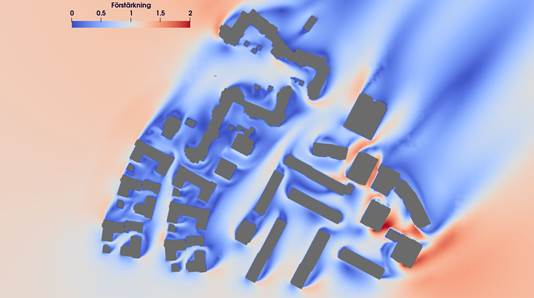

.. _handson:

Case Study
==========

.. questions::

   - What is 
   - What problem do 

.. objectives::

   - introduce the basics of OpenFOAM

.. instructor-note::

   - 15 min teaching
   - 0 min exercises

     
Stockholm
---------

This case uses OpenFOAM to calculate the wind fields around complex environments
with unknown influence from e.g. irregular buildings, focusing on
pedestrian-level wind (wind comfort) and wind loads on buildings,
teaching key CFD skills like setting up Atmospheric Boundary Layer (ABL)
conditions, using ``snappyHexMesh`` for complex geometries,
and applying solvers to understand wind patterns,
recirculation zones, and pressure distributions.

	   
Run the case step by step
+++++++++++++++++++++++++

Let us copy the case from the repository

.. code:: console

 $ cp -r  /PATH/XXXXXXstockholm .

The structure of the case is as follows:

.. code:: console

 $ cd stockholm
 $ ls
 0.orig Allclean Allrun constant system

 $ tree
 .
 ├── 0.orig (time directory starting with T=0, initial conditions)
 │   ├── U
 │   ├── epsilon
 │   ├── include
 │   │   └── ABLConditions
 │   ├── k (turbulence kenetic energy)
 │   ├── nut (turbulence viscosity)
 │   └── p
 ├── Allclean
 ├── Allrun
 ├── constant
 │   ├── transportProperties 
 │   ├── triSurface
 │   │   └── buildings.obj (actual building model)
 │   └── turbulenceProperties
 └── system
     ├── blockMeshDict
     ├── controlDict (the main dictionary for controlling the simulation)
     ├── decomposeParDict (dictionary for partitioning up the space into smaller chunks)
     ├── fvSchemes
     ├── fvSolution
     ├── meshQualityDict
     ├── snappyHexMeshDict
     └── surfaceFeatureExtractDict

The default setting is to run the application on 8 MPI-rank with
background mesh block of size XXXXXXXXXXX(40×40×40), and results will be 
stored at the last time step 1000. The initialization of the velocity field is
set to XXXXXXX m/s with a user-speficied angle as well.

Start by invoking the OpenFOAM environment

.. code:: bash
	  
   source $FOAM_BASHRC
   . $WM_PROJECT_DIR/bin/tools/RunFunctions

unset env variable

.. code:: bash
	  
   unset FOAM_SIGFPE
 
The obj file for the buildings should be already placed under the directory *constant/triSurface*

.. code:: bash
	  
   ls constant/triSurface/buildings.obj

Copy the original boundary conditions to a *0* time directory

.. code:: bash
	  
   cp -r 0.orig 0

   
At this stage, one could modify various boundary/inflow conditions if necessary.
See section `Boundary conditions <https://qianglise.github.io/openfoamold/handson/#boundary-conditions>`__
for more detail. Once all the boundary conditions are set, create the mesh
by using ``blockMesh`` and followed by ``snappyHexMesh`` for the mesh refinement.

.. code:: bash

   runApplication surfacefeature # recommended for creating high-quality meshes
   runApplication blockMesh # Create a block mesh first
   runApplication decomposePar -copyZero # Decompose a mesh for parallelization
   runParallel snappyHexMesh -overwrite # Run the snappyHexMesh in parallel

Some stuff worth noting here:

- Here, we have to provide the ``-copyZero`` flag, so that the *0* folder is
  simply copied to the processor directories without change. Otherwise,
  some stuff will be "optimized away", for example entries for boundaries
  that are not found in the mesh. 
- Running ``surfaceFeatures`` is not strictly necessary but it is highly recommended
  and often necessary for creating high-quality meshes in ``snappyHexMesh``
  when dealing with complex, sharp-edged geometries.

Next step, run the solver with the default setup of the domain decomposition and turbulence modelling.
See sections `Parallelization <https://qianglise.github.io/openfoamold/handson/#parallelization>`__ and
`Turbulence modelling <https://qianglise.github.io/openfoamold/handson/#turbulence-modelling>`__
below for more details about changing the default setup.

.. code:: bash
	  
   runApplication $(getApplication)

During the run, one should check whether the simulation is ok by inspecting the log file

.. code:: bash
	  
   tail -n 20  log.foamRun
   ...
   Time = 1000s

   smoothSolver:  Solving for Ux, Initial residual = 0.000211037, Final residual = 6.49593e-06, No Iterations 2
   smoothSolver:  Solving for Uy, Initial residual = 0.000128834, Final residual = 3.66066e-06, No Iterations 2
   smoothSolver:  Solving for Uz, Initial residual = 0.00404797, Final residual = 0.000126481, No Iterations 2
   GAMG:  Solving for p, Initial residual = 0.0411125, Final residual = 0.00133303, No Iterations 2
   time step continuity errors : sum local = 3.51157e-06, global = 3.31387e-07, cumulative = 0.000189408
   smoothSolver:  Solving for epsilon, Initial residual = 0.000736789, Final residual = 3.01329e-05, No Iterations 1
   smoothSolver:  Solving for k, Initial residual = 0.000747849, Final residual = 3.96933e-05, No Iterations 1
   bounding k, min: -0.13863 max: 2.26486 average: 0.18759
   ExecutionTime = 1836.11 s  ClockTime = 1843 s
   
   End

   
Once the run is finished, the fields are reconstructed from the last time step for post-processing

.. code:: bash
	  
   runApplication reconstructPar -latestTime
   

Boundary conditions
+++++++++++++++++++

The inlet and wall boundary conditions are set according to the following table,
while the top of the domain is set to a ``symmetry`` condition

.. list-table:: 
      :widths: 25 30 20 20
      :header-rows: 1

      * - Type
        - Inlet
        - Outlet
        - Wall	  
      * - U
        - atmBoundaryLayerInletVelocity + ABLConditons
        - zeroGradient
        - uniformFixedValue
      * - k
        - fixedValue
        - inletOutlet
        - kqRWallFunction	  
      * - epsilon
        - fixedValue
        - inletOutlet	  
        - epsilonWallFunction
      * - p
        - zeroGradient
        - totalPressure
        - zeroGradient	  
      * - nut
        - calculated
        - calculated
        - nutkRoughWallFunction

	  
To speficy flow direction, one need to change the entry ``flowDir`` in the file *0/include/ABLConditions*
 
.. code:: cpp

   Uref                 4.522;   // Reference mean streamwise flow speed [m/s]
   Zref                 51;      // Reference height [m]
   zDir                 (0 0 1); // Ground-normal direction 
   flowDir              (1 0 0); // Wind blowing in the positive X direction
   z0                   uniform 1.8; // Surface roughness length [m] 
   zGround              uniform 0.0; // Displacement height [m]

	  
Parallelization
+++++++++++++++

By default, 8 MPI ranks are used. One can change the number of MPI ranks
and the decomposition method in file *system/decomposeParDict*.

.. code:: cpp

 numberOfSubdomains 8; // MPI-rank
 method scotch;  // using scotch method for partition

Note: If one uses ``method hierarchical``, the entry ``hierarchicalCoeffs``
in the same file should be coordinately changed as well:

.. code:: cpp

 hierarchicalCoeffs
 {
 n (2 2 2); // 2x2x2 = 8 !!
 } 

 
Turbulence modelling
++++++++++++++++++++

The need to increase spatial and temporal resolution becomes impractical
as the flow comes into the turbulent regime, where problems of solution
stability may also occur. Turbulence modelling includes a range of methods,
e.g. Reynolds-averaged simulation (*RAS*) or large-eddy simulation (*LES*),
that are provided in OpenFOAM. In most transient solvers, the choice of
turbulence modelling method is selectable at run-time through
the ``simulationType`` keyword specified in file *constant/turbulenceProperties*:

.. code:: cpp 

 simulationType  RAS;

 RAS
 {
    RASModel        realizableKE;

    turbulence      on;

    printCoeffs     on;
 }

With ``RAS`` selected in this case, the turbulence model is selected by
the ``RASModel`` entry from a long list of available models.
The ``realizableKE`` model with wall functions is selected in
this tutorial which improves upon the standard ``k-Epsilon`` model.
The user should also ensure that turbulence calculation is switched on.

Due to the choice of the turbulence model, two extra variables are solved:
namely :math:`k`, the turbulent kinetic energy, and :math:`\varepsilon`,
the turbulent dissipation rate. To setup the model you will need three
additional files in the *0* directory: *nut*, *k*, *epsilon*.
One can create them by making a copy of the *p* file, and then modify them as needed.
The choices of wall function models are specified through
the turbulent viscosity field, *nut*, in the *0/nut* file:

.. code:: cpp

 dimensions      [0 2 -1 0 0 0 0];

 internalField   uniform 0;

 boundaryField
 {
    ...
    Wall
    {
        type            nutkRoughWallFunction;
	Ks		uniform 0.2; // Sand-grain roughness height 
        Cs		uniform 0.5; // Roughness constant 
        value           uniform 0;
    }
    ground
    {
        type            nutkRoughWallFunction;
	Ks		uniform 1.8; // Sand-grain roughness height 
	Cs		uniform 0.5; // Roughness constant 
        value           uniform 0;
    }
    ...
 }

For a wall boundary condition, *epsilon* is assigned with an ``epsilonWallFunction``
and a ``kqRwallFunction`` boundary condition is assigned to *k*. The latter is
a generic boundary condition that can be applied to any field that are of
a turbulent kinetic energy type, e.g. *k*, *q* or  Reynolds Stress *R*. 
More informaton on turbulence models can be found in the extended code guide.

